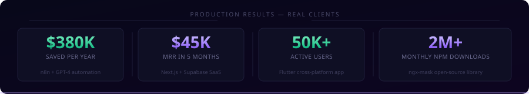
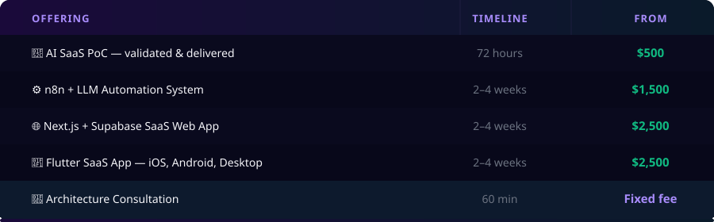

 

---

## 🧠 About Me

**Principal Software Engineer · Founder & Lead Engineer of [Novines Software](https://software.novines.eu/?ref=github)**

I build **AI-powered production systems** for founders and CTOs who need infrastructure that ships — not experiments that stall.

> Most clients come to me **second** — after the prototype failed, after the offshore agency disappeared, when the stakes are too high to get it wrong again.

In **12+ years** across fintech, legal tech, logistics, healthcare SaaS, and e-commerce, I've shipped systems handling **5K+ concurrent users** and **1M+ API calls/month**. No half-working demos. No disappearing after handoff.

I work like a **technical co-founder**: I understand your business problem as clearly as the technical one.

---

## 📈 Production Results — Not Demos

> *See production results → [software.novines.eu](https://software.novines.eu/?ref=github#cases)*

| Project | Stack | Result |
|---|---|---|
| 🔁 Replaced 12-person manual workflow | n8n + GPT-4 | **10K+ rec/day · 99.2% acc · $380K/yr saved** |
| 💳 Fintech SaaS platform | Flutter + Node.js | **$2M+/mo processed · 3 yrs · same client** |
| ⚖️ Legal research tool | React + LangChain | **73% ↓ attorney document review time** |
| 🚀 Multi-tenant SaaS | Next.js + Supabase | **$0 → $45K MRR in 5 months** |
| 📱 Cross-platform app | Flutter | **50K+ users — iOS, Android, Desktop** |
| 🤖 Logistics pipeline | OCR + GPT-4 + LangChain | **8× throughput — same headcount** |
| ⚡ LLM underwriting | FastAPI + pgvector | **4.2s → 280ms · $18K/mo infra saved** |
| 📦 ngx-mask OSS library | Angular | **2M+ monthly npm downloads · 1,000+ ⭐** |

---

## 🛠️ What We Build at [Novines Software](https://software.novines.eu/?ref=github)

<table>
<tr>
<td width="50%" valign="bottom">

**🤖 LLM Features & AI Integration**
GPT-4 / Claude / Gemini, RAG pipelines, LangChain agents, pgvector & Pinecone semantic search. Production-ready — not experimental.

**⚙️ AI Automation Workflows**
n8n & Make replacing entire manual operations. 10,000+ records/day at 99%+ accuracy.

**🌐 Multi-Tenant SaaS Platforms**
Next.js + Supabase — Stripe billing, RBAC, real-time, CI/CD. Live in **2–4 weeks**.

</td>
<td width="50%" valign="bottom">

**📱 Cross-Platform Mobile Apps**
Flutter: iOS, Android & Desktop from one codebase. Fintech, enterprise, biometric auth.

**🏗️ Backend Systems & APIs**
Node.js, NestJS, FastAPI, PostgreSQL — event-driven, compliance-ready for fintech & legal tech.

**🔍 RAG & Vector Search**
pgvector, Pinecone, semantic search, embedding pipelines, LLM eval frameworks.

</td>
</tr>
</table>

---

## ⚡ Tech Stack

**AI / LLM**

**Frontend & Mobile**

**Backend & Cloud**

---

## 📦 Open Source — ngx-mask

**[ngx-mask](https://www.npmjs.com/package/ngx-mask)** — Angular input masking library used globally in fintech, healthcare, logistics & enterprise SaaS

---

## 🤝 Trusted by Founders & Teams

<table>
<tr>
<td width="50%" valign="bottom">

> *"I've had the opportunity to work with Igor at two different companies—which probably tells you everything you need to know. When you find someone operating at his level, you make a point to bring them along."*

**— [Heath Glass](https://www.linkedin.com/in/heath-glass/)**, CTO · Enterprise Software & AI Platforms
⭐⭐⭐⭐⭐ LinkedIn Recommendation

</td>
<td width="50%" valign="bottom">

> *"He consistently delivers high-quality work, pays attention to details, and takes full ownership. His problem-solving skills and positive attitude make him a valuable contributor to any team."*

**— [Sergii Shubin](https://www.linkedin.com/in/sergshubin/)**, Product Development Manager
⭐⭐⭐⭐⭐ LinkedIn Recommendation

</td>
</tr>
</table>

**Clients include:** `YC-backed FinTech` · `Series-A HealthTech` · `$12M ARR SaaS` · `LegalTech AI` · `ClimateTech B2B` · `Retail Ops`

---

## 🚀 Start a Project

 

### [→ Scope Your Build at software.novines.eu ←](https://software.novines.eu/?ref=github)

*New project slots open · Production in 2–4 weeks*

 

<!-- SEO: hire AI developer, LLM product engineer, AI SaaS development, RAG pipeline developer, n8n automation expert, LangChain developer, production AI systems, fintech AI engineer, multi-tenant SaaS developer, Flutter developer, Next.js Supabase, GPT-4 integration, full stack AI engineer, Novines Software -->
